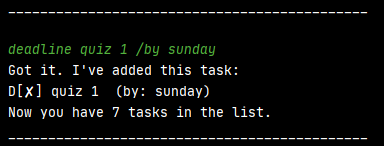
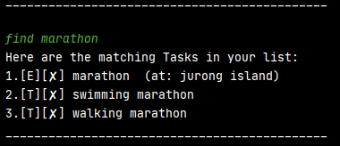
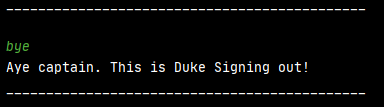

# Duke User Guide
- 1.Introduction
- 2.Starting the Program
- 3.Features
  - 3.1 Add Task
  - 3.2 Display List of Task
  - 3.3 Mark Task as Done
  - 3.4 Delete Task
  - 3.5 Find Task
- 4.Exiting the Program

## Introduction
Duke is a Command Line Interface program that allows 
user to record their list of task in a quick and simple
usage syntax

## 2. Starting the program
Before starting the program, ensure that your computer is configured for Java 11.
1. Download the jar file from [here](https://github.com/haroic1997/ip/releases/tag/A-Jar).
2. Extract the jar file to a root folder you prefer.
3. Open command prompt and change directory to the root folder of the jar file
4. Run this command: java -jar duke.jar

## 3. Features
### 3.1 Add Task
User can add 3 different type of task: ToDo, DeadLine and Event
#### 3.1.1 Add a ToDo Task
This Feature will allow users to add ToDo type of task to the list

Format: `todo <Description>`

Example: `todo Study CS2113t`

Output:

#### 3.1.2 Add a Deadline Task
This Feature will allow users to add Deadline to the list

Format: `deadline <Description> /by <deadline>`

Example: `deadline quiz 1 /by sunday`

Output:

#### 3.1.3 Add a Event Task
This Feature will allow users to add Event to the list

Format: `event <Description> /at <location>`

Example: `event marathon /at Jurong island`

Output:

### 3.2 Display list of Task
This feature will display the full list of task with the command `list`

Format: `list`

Example: `list`

### 3.3 Mark Task as Done
This feature will allow user to mark their task as done

Format: `done <ArrayIndex>`

Example: `done 2`

Output: 

### 3.4 Delete Task
This feature will allow user to delete redundant task

Format: `delete <ArrayIndex>`

Example: `delete 1`

Output: 

### 3.5 Find Task
This feature will allow user to find task based on given keyword

Format: `find <keyword>`

Example: `find book`

Output:

## 4. Exiting the Program
use the command `bye` to exit the program

Format: `bye`

Example: `bye`

Output:

